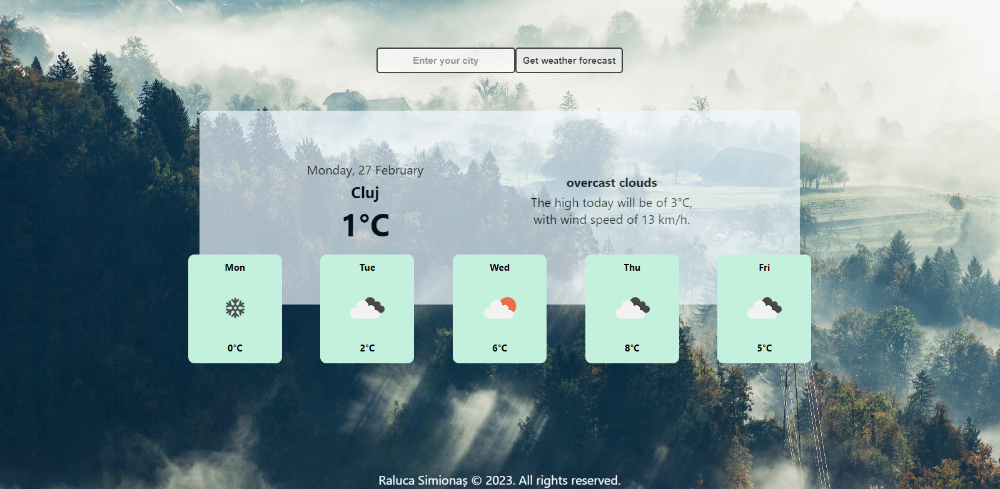

# Weather APP

While weather is sometimes difficult to predict, this app will give you the possibility to check the weather for any given city at a click and be prepared for it without looking out the window. Furthermore, it shows you a 5 day forecast, so that you won't have to worry about how the weather will be tomorrow... or the day after.

## Preview Image

## DEMO

The app is deployed at [weatherappbyralucas.netlify.app]. (https://weatherappbyralucas.netlify.app/).

## Local Usage

After downloading or cloning the project, run the following commands:

- `npm install`
- `npm start`

Also, make sure you use you own API from [Open Weather Map](https://openweathermap.org/).

## Features

The project has the following features:

- Display the current weather;
- Display a 5 day weather forecast;
- Get weather by city;

## Concepts

The project covers the following concepts:

- Reusable components;
- React hooks (useState, useEffect, useRef);
- React Bootstrap;
- CSS Modules;
- API requests;
